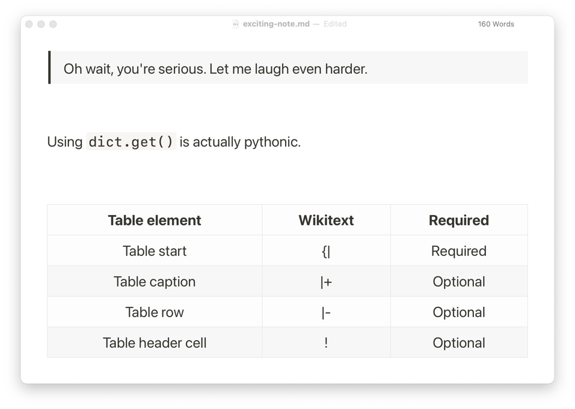

# Booklet Theme for Typora



## Getting Started

Booklet is a standalone application designed primarily for developers, and as such, it lacks the interactive user interface that most regular users may would expect when creating documents. The Booklet-Typora theme is an attempt to give more people the opportunity to integrate Booklet into their workflow by giving Typora a rough visual representation of what they can expect from exporting their Documents through Booklet.

### Local development

A local development server is available using:

```
deno run -A --watch=themes/ dev.ts
```

> Note: Make sure that "Disable cache" is enabled in Typora's developer tool network panel.
